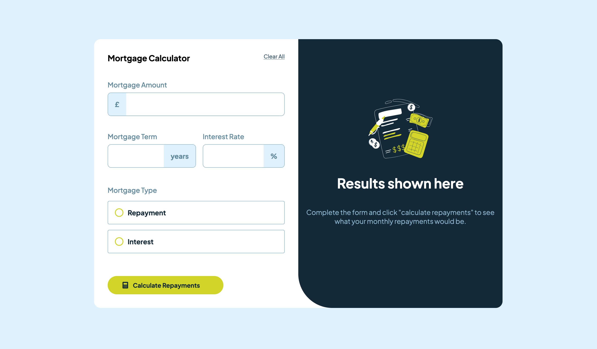

<h1 align="center">Mortgage-repayment-calculator</h1>

 <a align="center" href="https://ctrlaltsudo.github.io/Mortgage-repayment-calculator/">Live Demo</a>

 <a align="center" href="https://www.frontendmentor.io/solutions/mortgage-repayment-calculator-3ioNDlN8wS">Solution Page</a>

<h2 align="center">Project Screenshot<h2>

  </img>

## Description

This is a Frontend Mentor challenge, click the link above to visit the challenge page. 

## Built with 

HTML

CSS

Flexbox

Javascript

## What I learnt 

This was a lot harder than it looks, I struggled a lot with the javascript, I've not created a form before where I needed to take data from multiple inputs and radio buttons. I've not styled radio buttons this way before, I'm sure there is an easier method than what I settled on, admittedly with the help of ChatGPT. 

I thought this project would have been over fairly quickly, I was wrong, I need to go back over the fundementals of Javascript. 

## Authors

<a href="https://github.com/CtrlAltSudo">CtrlAltSudo</a>.

